# Blank

this is a very simple and crude game that can be also used as a game engine, though the user interface for making content is not intuitive.

this repository includes both the game, which is missing a bunch of content, and the tools that I built that were used to create it. The systems themselves of the game + tools are mostly done, but they are not very user friendly nor are they coded with good practices in mind as I started the project eons ago and just built upon it with minor changes.

## The Game

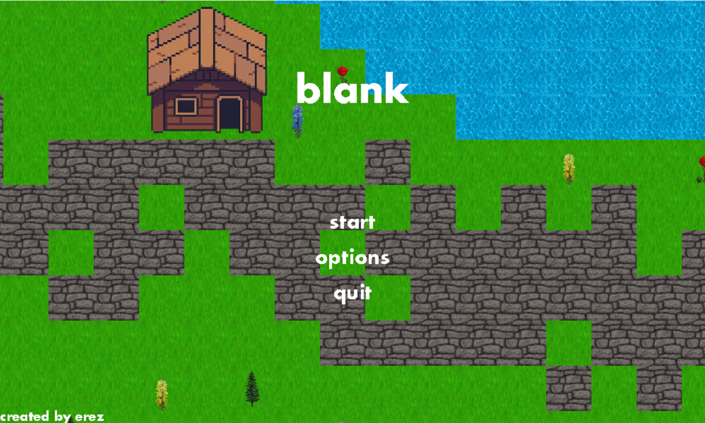

The game is a RPG genred game. In the game there are the expected systems for this kind of genre; such as combat, dialog, menus, quests, cutscenes, classes and more.

From the main menu you can choose to load your save or to create a new game, alongside changing the settings.

### navigation

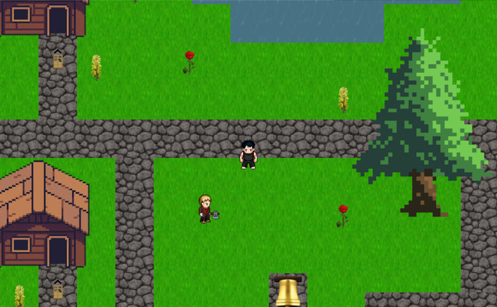

The game uses block textures as the building blocks of the map for convinience when building more maps using the map creation tool. All textures were stolen from minecraft texturepacks + itch.io, and most music was stolen from the game Octopath Traveler.

### interactivity

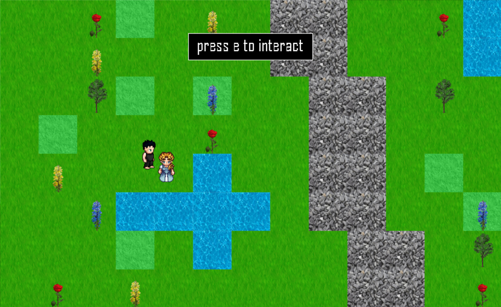

The game only requires a keyboard to be played. Though there are some functionalities that can be imitated using a mouse I wouldn't recommend using it at all.

There are 14 default key inputs: esc for menu exit, tab for menu selection, wasd for navigation, e for interact and battle choose, q for secondary interact and battle selection, shift for sprint and 1-3 for battle menu choosing.

all keybinds aside from esc and tab can be changed in the settings alongside volume, autosaves and more.

### menu

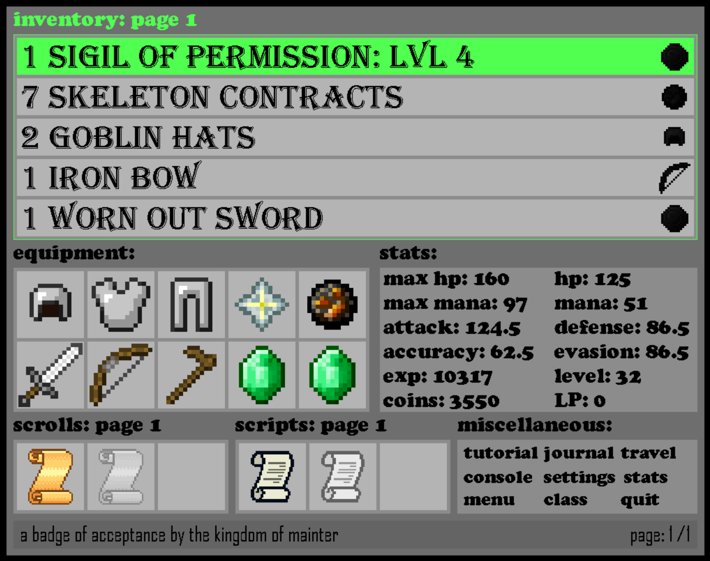

Inside the game, you can access the menu after pressing esc. 

As you may have noticed, the screen size of the game changes according to what you are viewing, which is one of the many bad choices I included early on and decided to ignore later.

The menu has 7 sections:

Inventory: a list of all the items you have. You can equip items from here on your character, and equip consumable items to use in battle.

Equipment: a list of all the items you are equiping

Stats: a list of the stats of your character. You can use LP (level points) to increase your stats after leveling up.

Scrolls/ Scripts: a list of all the scrolls and scripts you can use. these function as a collection of attacks you can use in battle. Scrolls are more magic orianted, and scripts are more weapons orianted.

Misc: these are miscellaneous menus with mostly self explanatory names.

The 'class' menu can be used to change your class, which can give you access to class actions in battle and to extra stat points.

The 'journal' menu can be used to get hints for quests or accept quest rewards.

### battle

there are two types of battles in this game.
- encoutner battles: includes battles with random enemies or minibosses. These battles are turn orianted.
- boss battles: battles with bosses. These are not turn orianted, you need to dodge while attacking, similar to undertale battles but you need to multitask dodging and using your battle skills instead of attacking once the enemy attack is over.

In both battles, you have the same attack menu, in which there are 3 sub-menus.
1. attacks: includes normal attacks, and attacks from scripts and scrolls.
2. inventory: includes items you equipped from the menu to be used in battle.
3. class actions: attacks of the equipped class.

In both battles you can press 'esc' and interact to give up.

NOTICE: there are attacks with delay. This is handled differently in both battle types.

#### encoutner battles

In this kind of battle, there is a turn order that decides and shows the order in which the turns are allocated. Each turn will give one action.

There are many types of attacks. Some are offensive, defensive, healing or supportive. For example you can chain many types of supportive attacks to try and hit the enemy with a high damage attack. Attack damage is calculated using the internal attributes of the attacks, the stats of the player, the boosts they recieved and more (critical hits, etc).

The attack above is the 'death slash' of the 'Samurai Teachings' script.

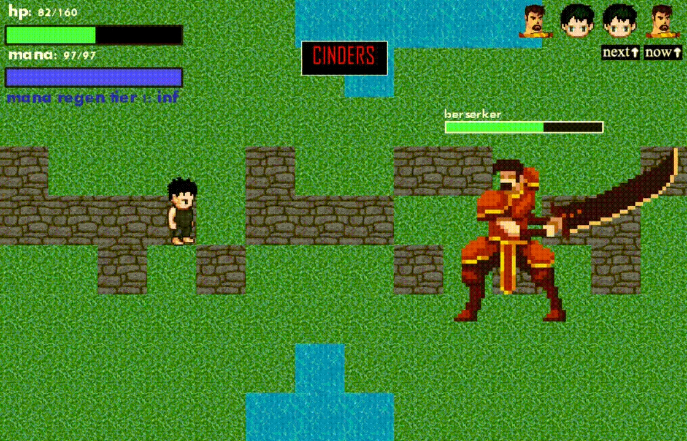

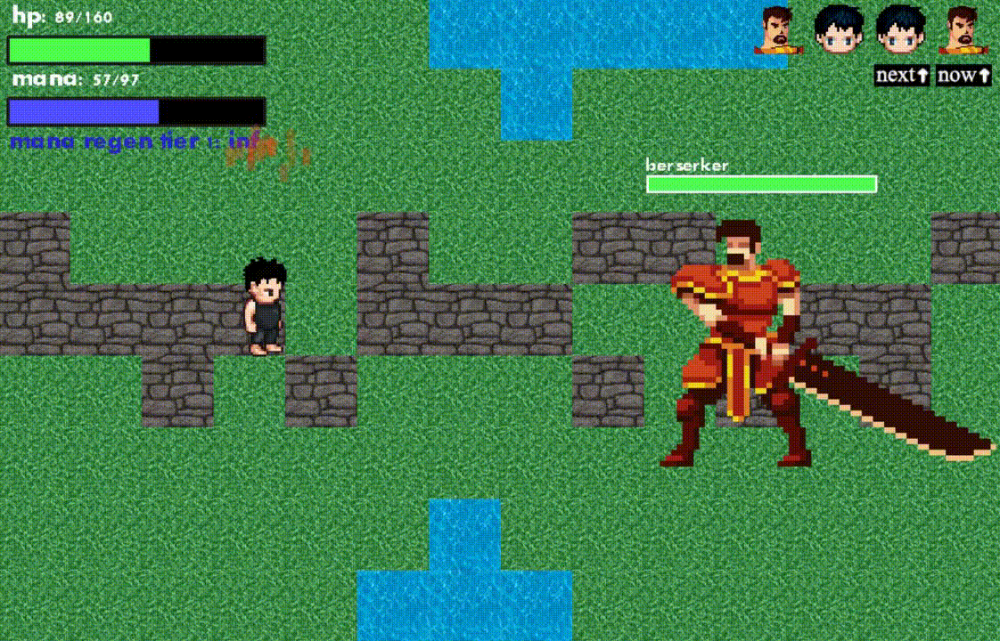

Enemies can also use all types of skills, from boosting their attacks, increasing the amount of turns they have in one turn order, or hitting hard. 

#### boss battles

In this battle, you will need to defeat the boss before you are defeated, or before the boss music ends. You will recover mana continuously, but you cannot spam attacks as there is an attack cooldown.

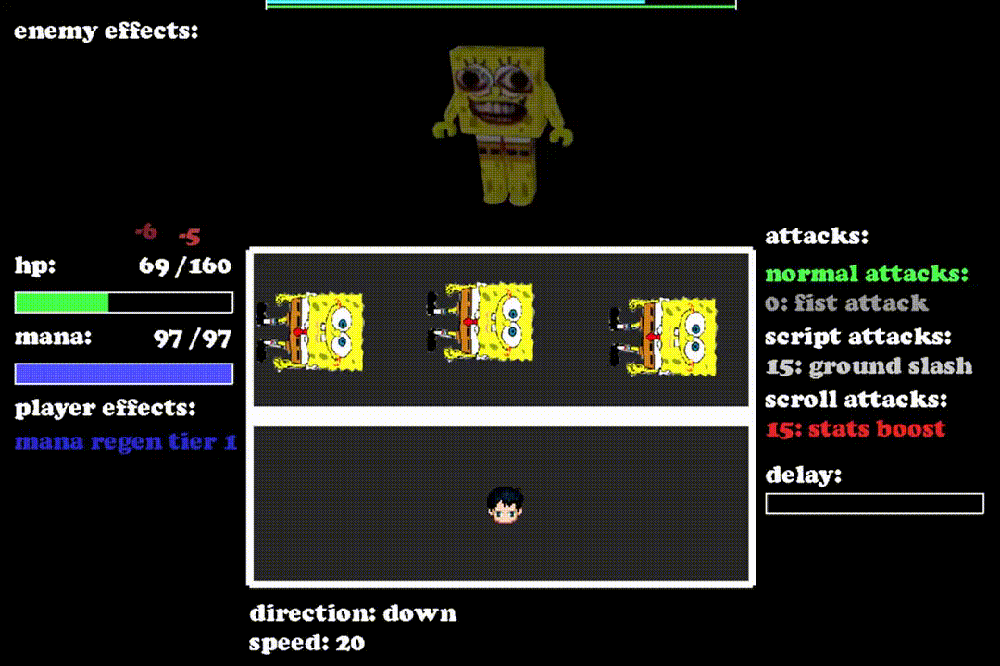

Be careful not to die!

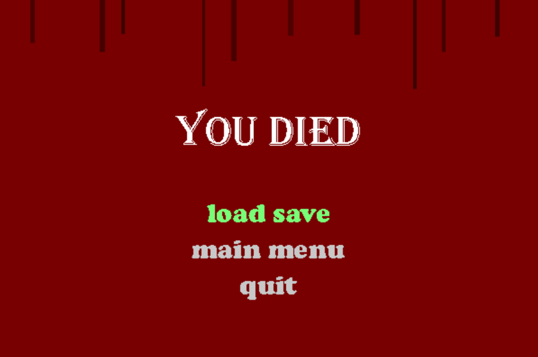

## Editors

this project includes 4 types of editors: battle editors, cutscene generator, map editor and other editor

in all types of editors, the resulting product will be printed in the console and then should be saved inside the corrosponding file as a data structure in a variable. One of the other things I did and couldn't bother to change, as I didn't know what the pickle module was, and I didn't bother checking it since I focused on the idea of using printed python objects to save the products. Only later when i couldn't bother to make a saving system by myself I found out the better way to do it.

All editors are used as a combination of the console and a visual element. after closing\ saving the product you are making, you need to add it to the corrosponding file as a variable (ex: map editor -> maps.py) before adding it to a dictionary, and then it will be avaiable for use instantly.

All editors are highly unintuitive and rough around the edges (also rough in the center), but there is a very basic manual in the top of every file\*. Also, they will probably crash when you use it.

\* The manual exists but you will probably need to check the code along it if you actually have intent to create something.

### battle editor

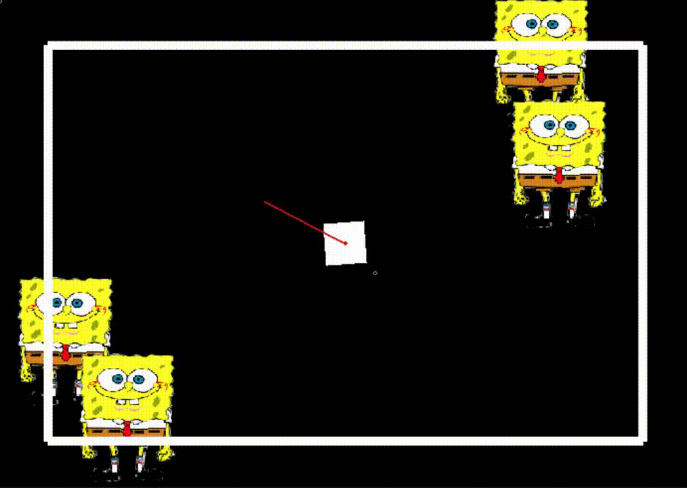

In this editor, you can create boss battles. encounter battles don't need an editor as its very easy to create them by hand.

This editor can create projectiles, hitboxes, commands, effects and more. Also it supports giving custom attributes/ functions to these objects (as long as you manually write the functions to do so). there are other functionalities like randomness (very very badly written), and a queue + objects saves.

### map editor

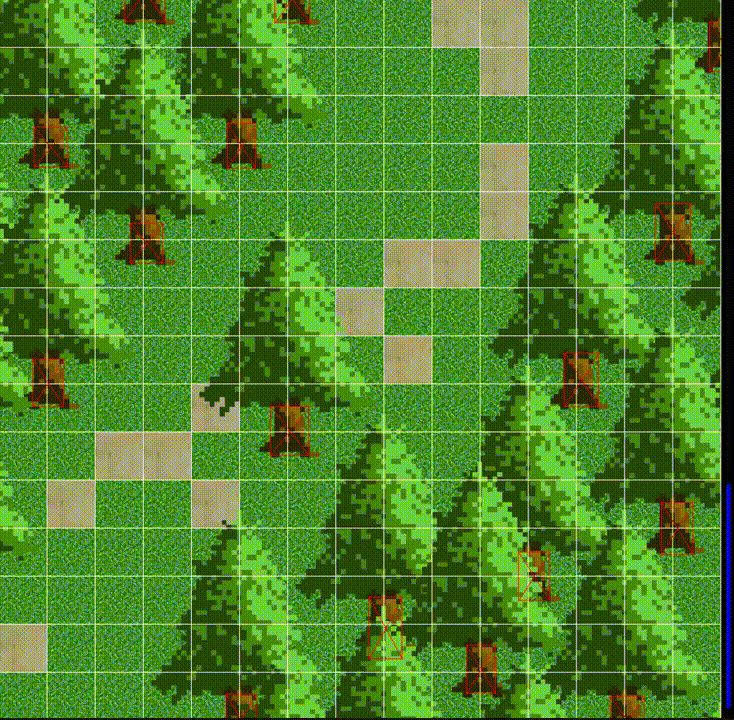

In this editor you can easily create maps and insert them into the game. this editor can place texture, hitboxses, interactive textboxes, sprites, passages to different maps and more into a map. Also, this editor has an option to save the resulting first 2 layers in a file so the game won't run slowly after trying to blit dozens of objects.

There is also a support editor for this editor, called image_checker.py, which helps get the exact rect number for hitboxes.

### cutscene editor

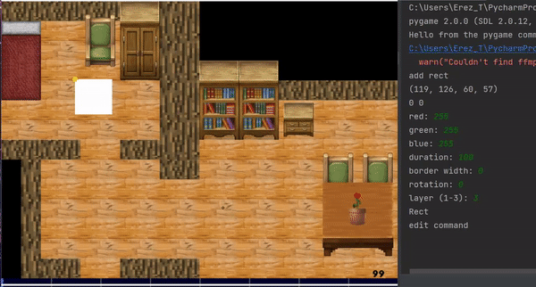

This editor is the hardest one to use, as unlike the previous 2 editors, once you compile a project you CANNOT relaunch the editor and to edit the product. as such you have to be content with your work, since you will need to start over if you wish to change it.

You can use it to create cutscenes that will play in the game. These cutscenes are moderately difficult to be created in this editor, and even a short cutscene can take a considerable amount of time to make.

(if you use this editor, make sure to press Z\X to submit changes to be able to see them when running it) 

### other editor

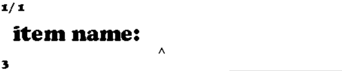

This editor is mostly usless, as its a single editor for multiple other features that can be manually created by hand instead of using an editor as they are just small objects instead of huge lists of info. Its still there for some level of convinience as it can save some headache.

## Project details (old readme)

runs on python 3.9 (will probably work on 3.7 or 3.8)
uses the modules:
pygame, shapely, mutagen, pydub, simpleaudio

* ONLY KEYBOARD IS FULLY SUPPORTED, IT IS POSSIBLE AND RECOMMENDED PLAYING WITHOUT TOUCHING THE MOUSE
* (meaning that there are some functions that are NOT supported by the mouse)

default controls:
w - up, a - left, s - down, d -right
e - interact, q - secondary action
tab - switch modes (used in menu or in shop)
e - battle confirm
q - battle switch menu
1, 2, 3 - pick option battle

for the full tutorial, go into the tutorial category inside the game
(start menu -> start button -> view tutorial)
or inside the game
(esc -> misc -> tutorial)

to start run init.py

notes:
if you decide to check the editors/ generators, check the MAP_GENERATOR only after you make sure save_image is set to false, since it automatically edits resource files when you close it if its true, and may ruin some maps if you are not familiar with it
This project was only  added to github around 2022, and then I duplicated the branch to avoid all the "questionable" commit names, but this project was started back in 2020. of course I didn't work on it for 3 years straight, only on and off.
